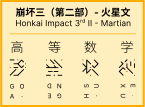
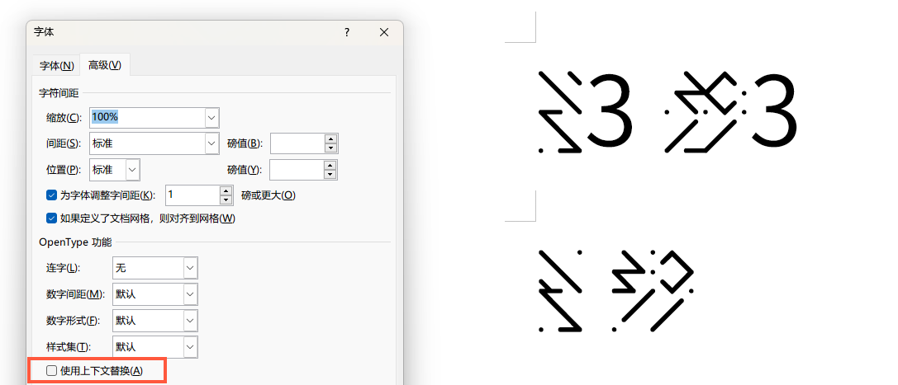

# HI3 II Martian Font

来自崩坏世界的火星文！~~你们火星上怎么用拼音啊？~~

## 食用方法

### 获取字体

本字体提供 OTF、TTF 与 WOFF2 格式，生成好的字体可以到 `Build` 文件夹获取。Windows 系统推荐使用 TTF 文件，其他系统随意。

### 如何写字

就如本文档开头的示例图片所示，这「火星文」就是将汉语拼音两个字母一组叠起来然后从左往右书写，若是尾部不够两个了就加个占位符，而声调则使用字母旋转来表示，不过占位符并不需要旋转。

本字体利用 Opentype 上下文替换（`calt` 特性）来实现字母随声调旋转，具体而言，输入声调只需在一个字的拼音之后跟上声调数字即可，例如「你好」则输入「ni3 hao3」。不过众所周知，一个字的拼音最长也就 6 个字母，所以特性只会对输入声调位置的前面 3 个层叠字符有影响。但在 Word 中，上下文替换并未默认启用，需要前去【字体】→【高级】页面勾选【使用上下文替换】来启用，启用前后的差异如下图右侧所示。

## 构建字体

`glyphs` 文件是 [Glyphs 软件](https://glyphsapp.com/)的文件格式，可以使用它来读入源文件并导出字体。

虽然 Google 的 [`fontmake`](https://github.com/googlefonts/fontmake) 工具集可以处理 `glyphs` 文件并构建字体，但目前的源文件因部分字形缺失，使用它来构建会报错。

## 贡献与反馈

如有任何问题，还请开启一个议题（issue）。
