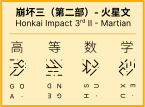

# HI3 II Martian Font

来自崩坏世界的火星文！~~你们火星上怎么用拼音啊？~~

## 食用方法

### 获取字体

本字体提供 OTF、TTF 与 WOFF2 格式，生成好的字体可以到 `Build` 文件夹获取。Windows 系统推荐使用 TTF 文件，其他系统随意。

### 如何写字

_本字体的字形来源于 https://honkai-3rd-ii-martian.vercel.app/ 。_

就如本文档开头的示例图片所示，这「火星文」就是将汉语拼音两个字母一组叠起来然后从左往右书写，若是尾部不够两个了就加个占位符，而声调则使用字母旋转来表示，不过占位符并不需要旋转。

本字体利用 Opentype 上下文替换（`calt` 特性）来实现字母随声调旋转，具体而言，输入声调只需在一个字的拼音之后跟上声调数字即可，例如「你好」则输入「ni3 hao3」。不过众所周知，一个字的拼音最长也就 6 个字母，所以特性只会对输入声调位置的前面 3 个层叠字符有影响。但在 Word 中，上下文替换并未默认启用，需要前去【字体】→【高级】页面勾选【使用上下文替换】来启用，启用前后的差异如下图右侧所示。

## 构建字体

### 使用 Glyphs 软件

`glyphs` 文件是 [Glyphs 软件](https://glyphsapp.com/)的文件格式，可以使用它来读入源文件并导出字体，也可以用来编辑源文件。

### 使用 `fontmake`

Google 的 [`fontmake`](https://github.com/googlefonts/fontmake) 工具集可以处理 `glyphs` 文件，它依赖 Python 工作，所以记得预先安装 Python 与 `pip`。

#### 适用于 Windows 的简单步骤

1. 将本项目克隆到一个合适的位置。
   
        $ git clone https://github.com/Wenti-D/HI3IIMartianFont

2. 可以直接双击 `build.bat` 来自动构建，构建好的字体将存储在 `build_custom` 文件夹内。当然也可以按照下面的步骤手动构建。

#### 手动构建步骤

1. 将本项目克隆到一个合适的位置：
   
        $ git clone https://github.com/Wenti-D/HI3IIMartianFont
        $ cd HI3IIMartianFont

2. 建议创建一个 Python 虚拟环境：
   
        $ python -m venv <your_venv_name>
    
    Windows 平台使用以下命令激活：

        $ <your_venv_name>/Script/activate
        
    Linux 平台使用以下命令激活：
    
        $ source <your_venv_name>/bin/activate

3. 安装依赖：

        $ python -m pip install -r requirements.txt

4. 构建字体：
        
        $ fontmake -g HI3IIMartian-Regular.glyphs --output-dir build_custom
        $ python -c "from fontTools.ttLib.woff2 import compress; compress('build_custom/HI3IIMartian-Regular.otf', 'build_custom/HI3IIMartian-Regular.woff2')"

    构建好的字体将会位于 `build_custom` 文件夹内。

## 贡献与反馈

如有任何问题，还请开启一个议题（issue）。
